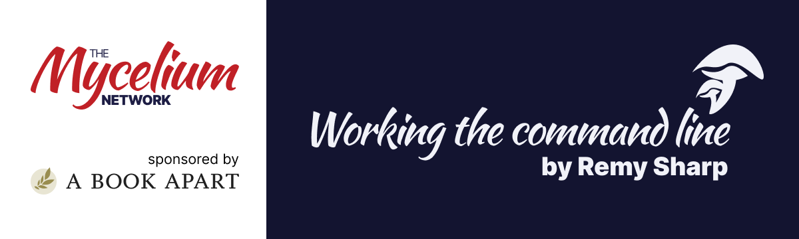

# 📚 _Working the Command Line_, by Remy Sharp (2016)

> BookClub cohort sponsored by **A Book Apart**, _"brief books for people who design, write, and code"_.

## 📌 Table of Contents

* [📙 About the Book](#-about-the-book)
* [👤 About the Author](#-about-the-author)
* [🌠 About the Sponsor](#-about-the-sponsor)
* [💫 Participants](#-participants)
* [📑 Notes & Resources](#-notes--resources)

## 📙 About the Book

Gain command-line shortcuts and processing techniques, install new tools and diagnose problems, and fully customize your terminal for a better, more powerful workflow.

The book is about the command line and the terminal and it's aimed squarely at the beginner audience wanting to learn about the command line.

It offers a gentle approach but spans over many topics, starts with navigating your computer in the terminal, to tricks and shortcuts, to installing software, to string manipulation techniques (which the command line is perfect for), to techniques on "how to shoot yourself in the foot" and finally how to customise your terminal.

## 👤 About the Author

[Remy Sharp](https://remysharp.com/) has been working commercially on the web since 1999 and blogging for over a decade. He runs his own consultancy, has been writing JavaScript long before it was cool, and founded the web conference ffconf in 2009.

Remy tends to attract bugs and he enjoys squishing them. He uses the terminal daily.

## 🌠 About the Sponsor

[A Book Apart](https://abookapart.com/) covers the emerging and essential topics in web design and development with style, clarity, and above all, brevity.

The goal of every title in their catalog is to shed light on an essential topic in a format that’s practical and fun — because enjoying what you read makes learning easier.

## 💫 Participants

### 🍄 **Mentor:**

[**@schalkneethling**](https://github.com/schalkneethling) 🇿🇦
 > Front end web engineer, JavaScript programmer, passionate about open source and the open web.

### 🌱 **Mentees:**

[**@bpires**](https://github.com/bpires) 🇧🇷 ·
[**@zoe-moment**](https://github.com/zoe-moment) 🇺🇸 ·
[**@Rico-Smit**](https://github.com/Rico-Smit) 🇿🇦 ·
[**@shriy-singh**](https://github.com/shriy-singh) 🇮🇳 ·
[**@KobayashiComputing**](https://github.com/KobayashiComputing) 🇺🇸

## 📑 Notes & Resources

* [Chapter 01 – "Just open the terminal..."](./chapter1/index.md)

* [Chapter 02 – Install All the Things](./chapter2/index.md)

* [Chapter 03 – Tools of the Terminal Trade](./chapter3/index.md)

* [Chapter 04 – How (Not) to Shoot Yourself in the Foot](./chapter4/index.md)

* [Chapter 05 – Making the Shell Your Own](./chapter5/index.md)
